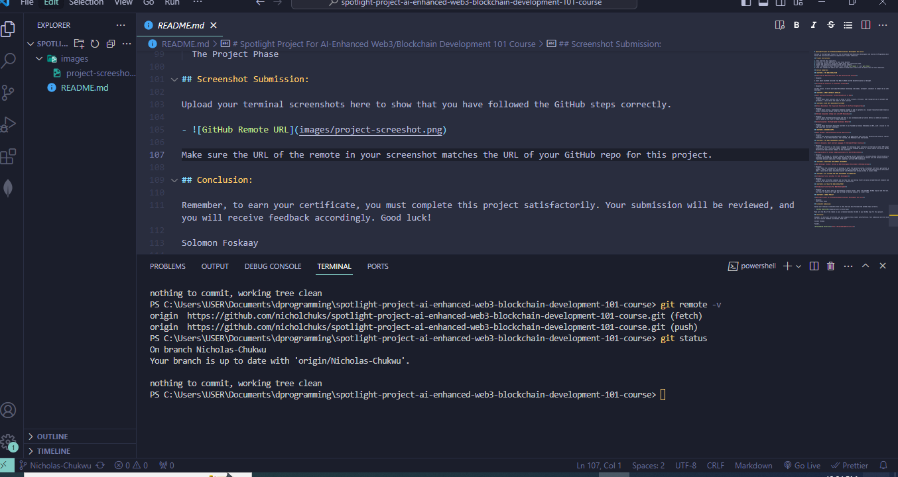

# Spotlight Project For AI-Enhanced Web3/Blockchain Development 101 Course

Welcome to the Spotlight Project for the AI-Enhanced Web3/Blockchain Development 101 Course at dProgramming University. Follow the instructions below to complete your project submission.

## Project Instructions:

1. Star and fork this repository.
2. Clone your forked repository to your local machine.
3. Create and switch to a new branch named after your certificate name.
4. Answer the questions provided in each section summary.
5. Take a screenshot of your terminal after running `git remote -v` and `git status`.
6. Push your changes and open a pull request to merge your branch into the main branch of this repository.

## Section Summaries:

### SECTION 1: THE WEB3 REVOLUTION

**Exploring the Web3 Revolution: The New Decentralized Internet**

- Response:

I learn about how Web3 envolved from Web1 to Web3 and the decentralization it brought.

**Unlocking the Potential of Blockchain Technology**

- Response:

In this lesson, I learnt alot about Blockchain technology like nodes, validator, consensor to prepare me as a Blockchain developer.

### SECTION 2: SMART CONTRACTS UNVEILED

**Smart Contracts Explained: The Building Blocks of Web3**

- Response:
  I learnt about smart contract, and it helps to offer a secure, efficient, and transparent way to automate and enforce agreements. I also learnt the types of smart contract

### SECTION 3: DIVE INTO BLOCKCHAIN PLATFORMS

**Bitcoin Blockchain: The Origin and Evolution of the First Cryptocurrency**

- Response:
  I learnt about bitcoin, and Satoshi Nakamoto founded it and it operates on a unique transaction model known as the Unspent Transaction Output (UTXO) and the SHA-256 algorithm.

**Ethereum Ecosystem: A Deep Dive into EVM Blockchains**

- Response:
  I learnt about the Ethereum Ecosystem and that it was conceptualized by Vitalik Buterin in 2013 and launched in 2015 and its based on the Proof of Stake Mechanism.

**Solana Ecosystem: The High-Speed Blockchain Network**

- Response:  
  I learnt about the Solana Ecosystem and that it was founded by Anatoly Yakovenko in 2017, with a vision to create a high-speed and low-cost blockchain.

### SECTION 4: DECODING DAPPS

**dApps Decoded: Unpacking Decentralized Applications**

- Response:
  I learnt that decentralized application (dApp) is an application that runs on a decentralized network, typically a blockchain. It has three features: the Frontend, the Middleware and the Backend.

### SECTION 5: TOP WEB3 PROGRAMMING LANGUAGES

**Vanilla Solidity: Smart Contract Language of Ethereum/EVM Smart Contracts**

- Response:
  I learnt that Solidity is the primary language for developing smart contracts on Ethereum and other EVM-compatible blockchains. It’s a statically typed, contract-oriented language designed to create complex contractual agreements and decentralized applications (dApps) on the blockchain.

**Solang Solidity for Solana: Adapting Solidity for Non-EVM Blockchains**

- Response:
  I learnt that Solang is a Solidity compiler targeting various blockchains, including Solana. While Solidity is synonymous with Ethereum, Solang opens the door for Solidity developers to venture into the Solana ecosystem. It translates Solidity code into a format compatible with non-EVM blockchains.

### SECTION 6: SETUP WEB3 DEVELOPMENT ENVIRONMENT

**Web3 Developer Toolbox: Setting up Web3 Development Environment (Ethereum/Solana)**

- Response:
  I leart about the prerequisites to develope on web3; the operating system, blockchain CLI Tools, git/github, package manager, nodejs, terminal etc and these tools are very important to be able to work effectively and efficiently in web3. I also learnt about blockchain wallet like Metamask and Solana and how to install them.

### SECTION 7: GIT & GITHUB FOR WEB3 DEVELOPMENT COLLABORATION

**Introduction To Git & GitHub for Web3 Development**

- Response:
  I learnt about Git/GitHub commands and how they help you develop faster and also collaborate with projects and how gitHub can be used to store your projects as repositiries.

### SECTION 8: AI TOOLS FOR WEB3 DEVELOPMENT

**Introduction To AI Tools For Web3 Development**

- Response:
  I learnt some AI Tools that can help develop projects faster. Tools like ChatGPT, GitHub Copilot and the rest. And that this tools if used in the right way can help to develop projects in a short time

### SECTION 9: COURSE PROJECT

**Spotlight Project For AI-Enhanced Web3/Blockchain Development 101 Course**

- Response:
  The Project Phase

## Screenshot Submission:

Upload your terminal screenshots here to show that you have followed the GitHub steps correctly.

- 

Make sure the URL of the remote in your screenshot matches the URL of your GitHub repo for this project.

## Conclusion:

Remember, to earn your certificate, you must complete this project satisfactorily. Your submission will be reviewed, and you will receive feedback accordingly. Good luck!

Solomon Foskaay

Founder,

[dProgramming University](https://dProgrammingUniversity.com)
